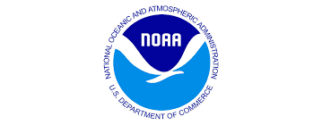
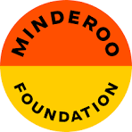

# FAIRe News & Updates
We are continuously working to enhance the FAIRe guidelines. Check this page regularly to see the latest updates, new developments, and ongoing activities!

### 2026-06-15 : Japanese translation of the FAIRe checklist ###
In response to requests from the Japanese eDNA community, we have developed a Japanese translation of the FAIRe Metadata Checklist. We gratefully acknowledge Mr. Masatoshi Nakamura (IDEA Consultants, Inc.) for leading the translation effort. Download the Japanese version [here](https://github.com/FAIR-eDNA/FAIRe_checklist/blob/main/FAIRe_checklist_v1.0.2_JP.xlsx). 

### 2025-11-13 : TDWG/GSC collaboration ###
In early 2025, we established the TDWG and GSC eDNA task groups with both original and new FAIRe members. Our goal is to develop eDNA checklists in Darwin Core (DwC) and MIxS under the TDWG and GSC frameworks. 
This effort is key to bridging FAIRe with  established databases, such as GBIF, OBIS, and INSDC, which predominantly use DwC and MIxS standards. 
For detailed information about our goals, please visit these resources:

- [TDWG eDNA task group](https://www.tdwg.org/community/gbwg/enviro/)
- [GSC eDNA task group](https://www.gensc.org/pages/projects/eDNA-project.html)
- Takahashi et al. (2026) A TDWG and GSC Collaborative Initiative To Develop an Environmental DNA (eDNA) Metadata Checklist. doi: [10.3897/biss.10.185867](https://biss.pensoft.net/article/185867/) 

### 2025-11-13 : FAIRe coding working group ###
We are excited to announce the formation of the FAIRe Coding Working Group, focused on developing FAIRe scripts and tools.  
The group includes members experienced in coding and passionate about FAIR principles. Our aim is to create scripts and tools that help the community adopt FAIRe guidelines in their workflows, automate data formatting, mapping, and submissions, and facilitate broader adoption of FAIRe practices.  
We plan to develop these tools in both **R** and **Python** as part of a new package.

## FAIRe workshops ##
To support the implementation of FAIRe workflows, we regularly host workshops in collaboration with partners around the world.

### Self-pased online tutorials ###
Can't attend a workshop in person? Our self-paced online tutorial materials are freely available.
These resources were originally developed for the [OBON FAIR eDNA Workshop](https://obon-ocean.org/2026/07/09/obon-fair-edna-workshop/). They cover the FAIRe and [BeBOP](https://bebop-obon.github.io/) standards, the [OBIS](https://obis.org/) data publication workflow, and include hands-on practical exercises using demonstration datasets that you can follow at your own pace with your own data.

**Tutorial materials** 
- [Video tutorials](https://www.youtube.com/playlist?list=PLS6jqgZoUzto)
- [FAIRe demonstration datasets](https://github.com/FAIR-eDNA/Workshop/tree/main/2026-07%20OBON%20workshop)
- [FAIRe NOAA datasets](https://github.com/aomlomics/ODE_testdata/tree/main/noaa-sefsc-gu1901)

### Upcoming workshops ###
- 2027-02 - [3rd Southern eDNA Conference](https://www.sednasociety.com/event-details/3rd-southern-edna-conference-2027), Canberra, Australia: In-person. Joint workshop with [Bioplatforms Australia](https://bioplatforms.com/) and [Galaxy Australia](https://usegalaxy.org.au/).
- 2026-10-27 - [Global eDNA Confernece](https://www.mtsociety.org/global-edna-conference), Seattle, USA: In-person. Joint workshop with [BeBOP](https://bebop-obon.github.io/) and [GBIF](https://www.gbif.org/)
- 2026-10-12 - [The 9th Annual Meeting of The eDNA Society](https://pub.confit.atlas.jp/en/event/edna9/content/outline), Sendai, Japan. In-person. Launguage - Japanese.
- 2026-07 - [OBON FAIR eDNA Data wokrshop](https://obon-ocean.org/2026/07/09/obon-fair-edna-workshop/): Self-paced online tutorials with accompanying live online sessions. 

### Previous workshops ###
- 2025-07-25 - London, UK. Hybrid. Joint workshop with [GBIF UK](https://www.gbif.org/country/GB/summary).
- 2025-04-10 - Perth, Australia. In-person.
- 2025-02-18 - [2nd Australian & New Zealand eDNA Conference](https://www.gbif.org/country/GB/summary), Wellington, New Zealand. In-person. 

## FAIRe Implementors ##
We are excited to see more eDNA communities and laboratories adopting the FAIRe guidelines in their workflows and making thousands of eDNA records FAIR!  

**2025 Implementation completed**

- NOAA (Atlantic Oceanographic Meteorological Laboratory ([AOML](https://www.aoml.noaa.gov/)) & Pacific Marine Environmental Laboratory ([PMEL](https://www.pmel.noaa.gov/))
-	[Minderoo Foundation OceanOmics](https://www.minderoo.org/resources/oceanomics/)

<table style="border: none; border-collapse: collapse; width: auto; margin: 0 auto;">
  <tr>
    <td style="border: none; text-align: center; vertical-align: middle;">
      
    </td>
    <td style="border: none; text-align: center; vertical-align: middle;">
      
    </td>
  </tr>
</table>

**Implementation in progress**

-	[All Nippon eDNA Monitoring Network (ANEMONE) GLOBAL](https://oceandecade.org/actions/anemone-global/)
-	[Integrated Marine Observing System (IMOS) eDNA sub-facility](https://imos.org.au/facility/biomolecular-observing/environmental-dna)
-	[Better Biomolecular Ocean Practices (BeBOP)](https://bebop-obon.github.io/protocol_template_description.html)
-	[Ocean Biomolecular Observing Network (OBON)](https://obon-ocean.org/)
-	[eDNA Frontiers](https://www.ednafrontiers.com/)
-	[Trace and Environmental DNA Laboratory (TrEnD Lab)](https://research.curtin.edu.au/scieng/research/trend-lab/), Curtin University
-	[Metabarcoding and Metagenomics (MBMG)](https://mbmg.pensoft.net/)
-	[eDNA Explorer](https://www.ednaexplorer.org/)

    

*If your lab/project/community has implemented or is actively working to implement FAIRe, please [contact us](https://fair-edna.github.io/contact.html) - we would love to list your organisation here and connect with you to hear your feedback.

